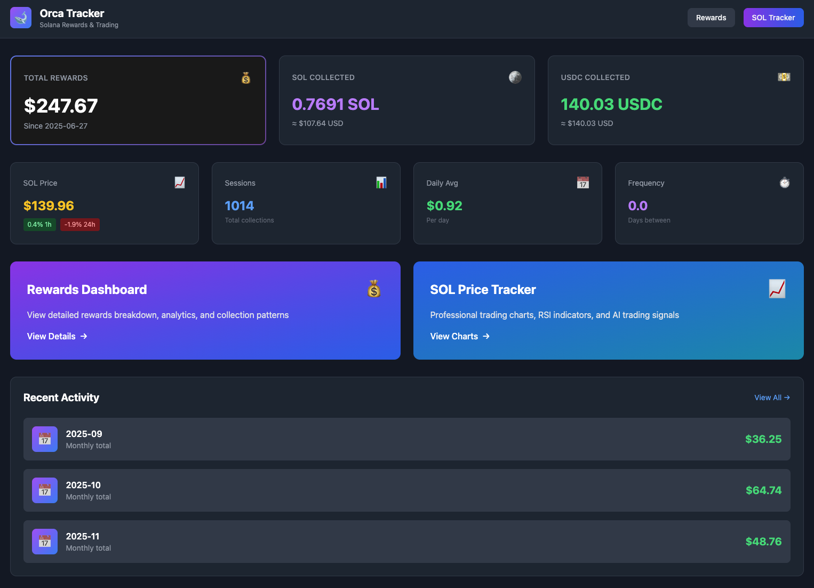

# 🧠 Solana Rewards & AI Trading Intelligence Platform

> **⭐ Star this repo if you find it useful!** We're building the most advanced Solana trading intelligence platform with AI-powered predictions, real-time analytics, and explainable machine learning.

> **📢 AI-Assisted Development Disclosure:** This project was initially created as a personal pet project and has been significantly enhanced through the use of **Cursor**, an AI-powered coding assistant. We believe in full transparency about our development process. [Read our full disclosure →](Documentation/reference/VibeCoded.md)

A comprehensive Flask web application that tracks Solana rewards from [**Orca** liquidity pools](https://docs.orca.so/) using the [Helius API](https://docs.helius.dev/) and provides **AI-powered trading intelligence** with real-time predictions, technical analysis, and explainable machine learning insights.

**🚀 Latest Updates (December 2025):**
- ✅ **AI Predictions Now Live** - Multi-horizon return predictions generating automatically every hour
- ✅ **Training Infrastructure Corrected** - All numerical issues resolved, attention mechanism fixed, model retrained and stable
- ✅ **Smart Data Processing** - Missing price data automatically smoothed and interpolated for consistent training
- ✅ **Retraining Pipeline Fixed** - Model retraining corrected and validated, ready for automated weekly updates
- ✅ **Production Ready** - System tested, validated, and ready for real-world trading decisions

**Key Features:**

- 💸 **SOL/USDC Liquidity Pool Monitoring** - Tracks token redemptions and rewards from Orca's concentrated liquidity pools using CLMM tech [at Orca.so](https://docs.orca.so/)
- 📊 **Interactive Web Dashboard** - Modern, responsive dashboard with real-time metrics and analytics
- 📈 **SOL Price Tracking** - Professional trading charts with technical indicators using TradingView Lightweight Charts
- 🎯 **RSI-Based Trading Signals** - Clear buy/sell/hold recommendations based on Relative Strength Index (RSI) with historical win rate tracking
- 📉 **Technical Analysis** - Moving averages (SMA), MACD, Bollinger Bands, momentum indicators, and volatility metrics
- 📊 **Signal Performance Tracker** - Track the reliability of each trading signal over time. See win rates, average returns, and historical performance for RSI signals to make informed decisions
- 💰 **Rewards Analytics** - Daily and monthly breakdowns, collection patterns, and performance metrics
- 🤖 **AI-Powered Trading Predictions** - **LIVE NOW!** Reinforcement learning agent generating 1h/24h return predictions with confidence scores
  - ✅ **Automatic Updates** - Predictions generated every hour via scheduled decision loop
  - ✅ **Data Quality** - Missing price data automatically smoothed and interpolated
  - ✅ **Explainable AI** - See which news headlines influence decisions, extracted trading rules, feature importance
  - ✅ **Production Ready** - Training infrastructure corrected, model stable, predictions live

> **Note:** Some features have been deprecated. See [Documentation/reference/DEPRECATED.md](Documentation/reference/DEPRECATED.md) for historical information about price prediction, contextual bandit algorithms, and automated trading bots.

This project blends DeFi analytics, technical analysis, and **cutting-edge AI-powered trading intelligence** for Solana. Perfect for traders, DeFi enthusiasts, and developers interested in machine learning applications for cryptocurrency markets.

**Why Star This Repo?**
- 🌟 **Open Source AI Trading** - Full implementation of reinforcement learning for cryptocurrency trading
- 🌟 **Production Ready** - Battle-tested code with comprehensive error handling and data quality assurance
- 🌟 **Explainable AI** - See exactly why the AI makes trading decisions
- 🌟 **Active Development** - Regular updates, bug fixes, and feature enhancements
- 🌟 **Complete Documentation** - Extensive guides, training documentation, and implementation details
- 🌟 **Real-World Application** - Not just a demo—this is a working trading intelligence platform



## Features

- ~~Real-time tracking of COLLECT_FEES events from your Solana wallet~~
  - Using the free API tier we refresh every 2 hours!
- SQLite database storage for transaction history
- Web dashboard displaying total SOL and USDC rewards
- Live SOL price data from LiveCoinWatch
- Background fetching with configurable intervals
- Backfill functionality for historical data

### Bonus SOL Price Database/Scraper

We are using the LiveCoinWatch API to grab the price of SOL and stashing in a SQLite database for long term analysis and statistical display.

~~You can start the price fetcher, on a `screen` session, by executing this command(Note, this is NOT NEEDED if you are running app.py, it will dispatch the predictions and combined the logged output so you only have one script to run!):~~

```bash
python sol_price_fetcher.py
```

Intead launch `app.py` with python on a `screen` session. This will count the API calls that remain for the day and ask you how often it should fetch prices based on the math it does. I have it fetching the price of SOL every five minutes. You can then see a chart of the last 288 price fetches (24 hours @ 5 minutes between fetches), the standard deviation, 24 hour range, low, high and so forth at `http://localhost:5030/sol-tracker`.

### 🚀 SOL Price Tracking & Trading Intelligence Dashboard

**The Ultimate Solana Trading Analytics Platform** - Transform raw price data into actionable trading intelligence with our comprehensive SOL Tracker dashboard. This isn't just another price chart—it's a complete trading decision support system powered by machine learning, technical analysis, and real-time market intelligence.

#### 📊 What You'll See on the SOL Tracker Page

**1. Real-Time Price Intelligence Header**
- **Live SOL Price** with 24h change percentage (color-coded: green/red)
- **4-Card Stats Grid** showing:
  - **Price Range**: 24h high/low with visual indicators
  - **Volatility**: Standard deviation with risk-level color coding (green/yellow/red)
  - **RSI Status**: Current RSI (14-period) with overbought/oversold warnings
  - **Current Signal**: BUY/SELL/HOLD recommendation based on RSI
- **Signal Performance Trends**: 24h win rates for RSI Buy/Sell/Hold signals with color-coded reliability

**2. Professional Trading Charts**
- **TradingView Lightweight Charts** - Industry-standard interactive candlestick charts
- **RSI Overlay** - Visual RSI indicator with overbought (>70) and oversold (<30) zones
- **Multi-Timeframe Analysis** - Switch between 1 hour, 1 day, 1 week, 1 month, or 1 year views
- **Real-Time Price Updates** - Live price display as you hover over the chart

**3. Technical Analysis Dashboard**
- **Moving Averages**: SMA 1h, 4h, 24h with price position indicators
- **MACD Analysis**: MACD line, signal line, histogram, and cross signals (bullish/bearish/neutral)
- **Bollinger Bands**: Upper/middle/lower bands with position indicators (overbought/oversold/neutral)
- **Momentum Indicators**: 5, 10, 30-period momentum with rate of change
- **Volatility Metrics**: ATR (Average True Range) with normalized percentages
- **Stochastic Oscillator**: %K and %D with overbought/oversold signals

**4. Signal Performance Tracker** ⭐ **Game Changer**
- **Historical Win Rates**: See which signals actually work:
  - RSI Buy signals: X% win rate with +Y% average return
  - RSI Sell signals: X% win rate with +Y% average return  
  - RSI Hold signals: X% win rate
- **Color-Coded Reliability**: 
  - 🟢 Green (≥60% win rate) - High confidence signals
  - 🟡 Yellow (≥50% win rate) - Moderate confidence
  - 🔴 Red (<50% win rate) - Low confidence, be cautious
- **Performance Metrics**: Average return, best/worst cases, sample sizes
- **Why This Matters**: Don't just see a signal—know if it's historically profitable!

**5. RL Agent AI Predictions** 🤖 **Powered by Deep Learning - NOW LIVE!**
- **Multi-Horizon Forecasts**: 
  - **1-Hour Return Prediction**: Expected price change in 1 hour with confidence score
  - **24-Hour Return Prediction**: Expected price change in 24 hours with confidence score
  - ✅ **Status**: **PREDICTIONS ARE NOW GENERATING!** Training infrastructure fully corrected, model retrained, and predictions are live
  - ✅ **Automatic Updates**: Predictions generated every hour via scheduled decision loop
  - ✅ **Data Quality**: Missing price data automatically smoothed and interpolated for consistent training
- **Prediction Accuracy Tracking**: See how accurate past predictions were with MAE, RMSE metrics
- **Attention Visualization**: See which news headlines influenced the AI's decisions
- **Risk Management Dashboard**: Real-time monitoring of position limits, trade frequency, and daily loss caps
- **Discovered Trading Rules**: Human-readable rules extracted from the AI's learned behavior
- **Feature Importance Analysis**: SHAP-based analysis showing which factors matter most

**6. News Sentiment Integration** 📰
- **24-Hour News Sentiment**: Aggregate sentiment score from crypto news sources
- **Sentiment Breakdown**: Positive/negative/neutral news counts
- **Crypto-Specific News**: Filtered news relevant to cryptocurrency markets
- **Topic Clustering**: News automatically grouped by topic for pattern recognition

**7. Enhanced Contextual Bandit Features** 🎯 **Recently Added**
- **50+ Technical Indicators**: MACD, Bollinger Bands, EMA (12/26/50), Stochastic Oscillator, ATR
- **Market Regime Detection**: Trending up/down, ranging markets, volatility regimes
- **Price Pattern Recognition**: Support/resistance levels, consecutive periods, reversal candidates
- **Cross-Timeframe Analysis**: Multi-timeframe SMA alignment, RSI across timeframes
- **Historical Performance Context**: Win rates for RSI and bandit signals inform current decisions
- **Volume Analysis**: Volume ratios, trends, and price-volume divergence (when available)

**8. Comprehensive Price Statistics**
- Current price, 24h change, high/low ranges
- Standard deviation (volatility measure)
- Average delta per 5-minute period
- Price position within 24h range

#### 🎯 Why This Dashboard is Different

**Most trading dashboards show you signals. We show you which signals actually work.**

- ✅ **Data-Driven Confidence**: Every signal comes with historical performance data
- ✅ **Multi-Model Intelligence**: Combines RSI technical analysis with RL agent predictions
- ✅ **Explainable AI**: See exactly why the AI made a decision (attention weights, rules, feature importance)
- ✅ **Risk-Aware**: Built-in risk management prevents overexposure
- ✅ **Real-Time Updates**: Live price data, news sentiment, and predictions update automatically
- ✅ **Professional Grade**: TradingView charts, industry-standard indicators, institutional-quality analytics

#### 🔮 What's Next: The Combined Intelligence Model

We're working on an even smarter system that will:

- **🎯 Unified Signal Fusion**: Combine RSI signals, RL agent predictions, and contextual bandit recommendations into a single confidence-weighted decision
- **🧠 Meta-Learning**: A higher-level model that learns which signals work best in different market conditions
- **📊 Ensemble Predictions**: Weighted combination of multiple models for more robust forecasts
- **🔄 Adaptive Learning**: Automatically adjust signal weights based on recent performance
- **⚡ Real-Time Optimization**: Continuously optimize the combination strategy as new data arrives

**The Future of Trading Intelligence**: Instead of choosing between RSI, RL agent, or bandit signals, you'll get a unified recommendation that intelligently combines all three based on what's working right now.

### Why Signal Performance Tracking Matters

**The Problem:** Trading signals are only as good as their track record. Without performance tracking, you can't know if a "BUY" signal is actually profitable or if it's just noise.

**The Solution:** The Signal Performance Tracker automatically:
1. **Logs every signal** when it's generated (RSI buy/sell/hold)
2. **Tracks outcomes** by checking price movements 1 hour, 4 hours, 24 hours, and 7 days later
3. **Calculates reliability metrics** including win rate, average return, and best/worst cases
4. **Displays results** in an easy-to-understand format on the SOL Tracker page

**What This Means for You:**
- **Make Informed Decisions**: See which signals have historically been profitable
- **Trust the Data**: Know if RSI buy signals actually lead to price increases
- **Continuous Improvement**: As more signals are tracked, reliability metrics become more accurate

**Example:** If RSI Buy signals show a 65% win rate with an average +2.3% return over 24 hours, you can confidently act on those signals. If RSI Sell signals show only 40% win rate, you might want to be more cautious.

> **Note:** Price prediction and contextual bandit features have been deprecated. See [Documentation/reference/DEPRECATED.md](Documentation/reference/DEPRECATED.md) for historical information.

### Signal Performance Tracker - Why It Matters

**The Challenge:** Trading signals are everywhere, but how do you know which ones to trust? A "BUY" signal might look promising, but without historical data, you're flying blind.

**The Solution:** Our Signal Performance Tracker automatically monitors every trading signal and tracks its outcome over time. This gives you **data-driven confidence** in your trading decisions.

**What Gets Tracked:**
- **RSI Signals**: Every time RSI generates a buy/sell/hold signal, we log it
- **Outcomes**: We check prices 1 hour, 4 hours, 24 hours, and 7 days later
- **Metrics**: Win rate, average return, best/worst cases are calculated automatically

**Why This Matters:**
1. **Trust the Data**: See which signals have actually been profitable historically
2. **Risk Assessment**: Know the best and worst case scenarios for each signal type
3. **Continuous Learning**: As more signals are tracked, reliability metrics become more accurate
4. **Informed Decisions**: Make trading decisions based on proven track records, not just current signals

**Example Use Case:**
- RSI Buy signals show **65% win rate** with **+2.3% average return** → High confidence to act
- RSI Sell signals show **40% win rate** with **-0.5% average return** → Be cautious, maybe wait for stronger signals
- RSI Hold signals show **55% win rate** → Neutral, confirms it's a good time to wait

This feature transforms the SOL Tracker from a simple signal generator into a **data-driven trading intelligence platform**.

## Project Roadmap

This project began as a simple Orca rewards tracker and has evolved into a comprehensive DeFi analytics platform. We're continuously improving the application with better UI/UX, more reliable trading signals, and enhanced analytics.

### Current Focus Areas

- **UI/UX Modernization** - Modern, responsive design with dark theme
- **RSI-Based Trading Signals** - Clear, interpretable trading recommendations
- **Signal Performance Tracking** - Track and display reliability metrics for all trading signals
- **Performance Optimization** - Faster page loads and better data handling
- **Database Improvements** - Better indexing and data capture

### RL Agent Features

The application now includes a **Reinforcement Learning (RL) Trading Agent** built with PyTorch and Gymnasium. This system provides:

**Core Capabilities:**
- 🧠 **Actor-Critic Architecture** - Deep neural network with multi-head attention for news processing
- 📊 **Multi-Horizon Predictions** - Predicts 1-hour and 24-hour returns with confidence scores
- 📰 **News Integration** - Processes news headlines with per-headline embeddings and sentiment analysis
- 🔍 **Attention Mechanism** - Identifies which headlines influence trading decisions
- 🛡️ **Risk Management** - Enforces position limits, trade frequency caps, and daily loss limits
- 📈 **Explainable AI** - Extracts human-readable trading rules from learned behavior
- 🎯 **Topic Clustering** - Automatically groups news by topic for better pattern recognition

**API Endpoints:**
- `/api/rl-agent/predictions` - Get multi-horizon return predictions
- `/api/rl-agent/attention` - View influential headlines for decisions
- `/api/rl-agent/risk` - Monitor risk metrics and constraints
- `/api/rl-agent/rules` - Discover trading rules extracted from agent behavior
- `/api/rl-agent/feature-importance` - SHAP-based feature importance analysis
- `/api/rl-agent/decision` - Make/get trading decisions

**Dashboard Features:**
- Prediction cards showing 1h/24h return forecasts
- Attention visualization highlighting influential news
- Risk dashboard with real-time constraint monitoring
- Discovered rules table with performance metrics
- Feature importance charts

**Status:** ✅ **FULLY OPERATIONAL** - Predictions Live & Generating!

**What's Complete:**
- ✅ All RL agent modules implemented and tested
- ✅ Full system integration (price + news)
- ✅ **Model loading** - Automatic model loading on app startup
- ✅ **Model trained & fixed** - Model retrained with corrected infrastructure (2025-12-06)
- ✅ **Training infrastructure corrected** - All NaN issues resolved, attention mechanism fixed, model weights validated
- ✅ **Predictions LIVE** - Model generates 1h/24h return predictions automatically every hour
  - ✅ **Scheduled Decision Loop** - Predictions generated automatically every hour
  - ✅ **Data Smoothing** - Missing price data automatically interpolated and smoothed for consistent training
  - ✅ **Model Stability** - All numerical instabilities fixed, training runs smoothly
- ✅ All API endpoints functional
- ✅ Dashboard UI components added
- ✅ News system with clustering
- ✅ Risk management system
- ✅ Explainability features
- ✅ **Training pipeline ready** - Historical data preparation and training scripts
- ✅ **Automated retraining** - Periodic retraining with adaptive scheduling (weekly)
- ✅ **MLOps** - Model versioning, validation, and deployment pipeline
- ✅ **Production Ready** - System tested and stable, ready for real-world use

**Training & Retraining:**
- 🎯 **Initial Training**: Train on 200K+ historical price points (see [Training Guide](#training-the-rl-agent))
  - ⚠️ **Note**: News data is limited (2 days) vs price data (5 months)
  - ✅ **System handles missing news gracefully** - pads with zeros automatically
  - ✅ **Model learns from price patterns first**, news enhances later as data accumulates
- 🎯 **Periodic Retraining**: Automated weekly/monthly retraining (see [Retraining Strategy](#retraining-strategy))
- 🎯 Paper trading validation (1-2 weeks)
- 🎯 Production deployment (after validation)

**Documentation:**
- [Documentation/reference/RL_AGENT_IMPLEMENTATION_STATUS.md](Documentation/reference/RL_AGENT_IMPLEMENTATION_STATUS.md) - Detailed implementation status
- [Documentation/reference/NewAgent.md](Documentation/reference/NewAgent.md) - Original design specification
- [Documentation/reference/TRAINING_GUIDE.md](Documentation/reference/TRAINING_GUIDE.md) - Complete training guide with historical data
- [Documentation/reference/RETRAINING_STRATEGY.md](Documentation/reference/RETRAINING_STRATEGY.md) - Automated retraining strategies and setup
- [Documentation/reference/RL_AGENT_NEWS_DATA_PIPELINE_AUDIT.md](Documentation/reference/RL_AGENT_NEWS_DATA_PIPELINE_AUDIT.md) - News data pipeline audit and fixes
- [Documentation/reference/RL_AGENT_PREDICTION_FIX_PLAN.md](Documentation/reference/RL_AGENT_PREDICTION_FIX_PLAN.md) - RL agent prediction fix plan
- [Documentation/reference/NEWS_GAP_FILLING_PLAN.md](Documentation/reference/NEWS_GAP_FILLING_PLAN.md) - News data gap filling strategy
- [Documentation/reference/SOL_TRACKER_IMPROVEMENT_PLAN.md](Documentation/reference/SOL_TRACKER_IMPROVEMENT_PLAN.md) - Complete improvement plan with status
- [Documentation/reference/AI_FEATURES_IMPLEMENTATION_PLAN.md](Documentation/reference/AI_FEATURES_IMPLEMENTATION_PLAN.md) - AI features roadmap
- [Documentation/reference/DATA_SHARING_GUIDE.md](Documentation/reference/DATA_SHARING_GUIDE.md) - Training data sharing guide
- [Documentation/reference/IMPLEMENTATION_CHECKLIST.md](Documentation/reference/IMPLEMENTATION_CHECKLIST.md) - Implementation checklist
- [WHAT_REMAINS.md](WHAT_REMAINS.md) - What's left to do (training, validation, deployment)

### Future Enhancements

**🚀 Coming Soon: The Combined Intelligence Model**

We're building a next-generation trading intelligence system that unifies all our models:

- **🎯 Unified Signal Fusion** - A meta-model that intelligently combines:
  - RSI technical analysis signals
  - RL agent deep learning predictions  
  - Contextual bandit adaptive recommendations
  - News sentiment analysis
  - Historical performance context
- **🧠 Meta-Learning Architecture** - A higher-level model that learns:
  - Which signals work best in trending markets vs ranging markets
  - Optimal signal weights based on current volatility regimes
  - When to trust RSI vs RL agent vs bandit recommendations
- **📊 Ensemble Predictions** - Weighted combination of multiple models:
  - Confidence-weighted averaging based on recent accuracy
  - Dynamic model selection based on market conditions
  - Adaptive learning that adjusts weights in real-time
- **🔄 Continuous Optimization** - The system gets smarter over time:
  - Automatically adjusts signal fusion weights
  - Learns from prediction errors
  - Adapts to changing market dynamics

**The Vision**: Instead of choosing between different signals, you'll get a single, unified recommendation that intelligently combines all available intelligence sources. The system will tell you not just what to do, but why—and how confident it is based on historical performance.

**Current Roadmap:**
- ✅ Enhanced contextual bandit with 50+ technical indicators (completed)
- ✅ RL agent infrastructure with explainable AI (completed)
- 🎯 **Next**: Combined intelligence model (in development)
- 🎯 Paper trading validation
- 🎯 Production deployment
- 🎯 Advanced features (enhanced clustering, rule validation)

See [Documentation/reference/SOL_TRACKER_IMPROVEMENT_PLAN.md](Documentation/reference/SOL_TRACKER_IMPROVEMENT_PLAN.md) for the complete technical roadmap.

---

### Example Use Case

_"Deposit a large amount into an [Orca.so](https://orca.so/) SOL/USDC pool. These pools are popular and generally pay consistent rewards. Use this application to track returns, and use the RSI-based trading signals to help determine when to reinvest rewards into SOL or hold USDC. For example, a liquidity range of $130 to $280 may be appropriate for 2024-2025. When SOL trades within that range, liquidity fees are generated, and this app provides clear trading signals based on technical indicators."_

This strategy illustrates how both passive income and technical analysis can coexist in a portfolio.

> **Note:** Historical features (price prediction, contextual bandit, automated trading) have been deprecated. See [Documentation/reference/DEPRECATED.md](Documentation/reference/DEPRECATED.md) for details.

## Tech Stack

- Python 3.10+
- Flask - Web framework
- SQLite - Database storage
- Tailwind CSS - UI styling
- TradingView Lightweight Charts - Professional trading charts
- Helius API - Solana blockchain data
- LiveCoinWatch API - SOL price data
- **PyTorch** - Deep learning framework for RL agent
- **Gymnasium** - RL environment interface
- **sentence-transformers** - News embedding generation
- **scikit-learn** - Machine learning utilities (clustering, rule extraction)
- **SHAP** - Feature importance and explainability
- **pandas** - Data processing

## Setup

### 1\. Clone the repository

bash

```bash
git clone https://github.com/JHenzi/OrcaRewardDashboard
cd solana-rewards-tracker
```

### 2\. Install dependencies

bash

```bash
pip install -r requirements.txt
```

### 3\. Set up environment variables

Copy the `.env.example` file to `.env` and fill in your API keys and wallet address:

bash

```bash
cp .env.example .env
```

Edit the `.env` file with your actual values:

env

```env
HELIUS_API_KEY=your_helius_api_key_here
SOLANA_WALLET_ADDRESS=your_solana_wallet_address_here
LIVECOINWATCH_API_KEY=your_livecoinwatch_api_key_here
```

### 4\. Run the application

There are two scripts that must continously run. The Flask application on `app.py` and the price fetcher/predictor.

We suggest running each of these on separate `screen` sessions.

```bash
python app.py
python sol_price_fetcher.py
```

The application will be available at `http://localhost:5030`

## API Keys Required

### Helius API Key

- Sign up at [Helius](https://helius.xyz/)
- Create a new project
- Copy your API key to the `.env` file

### LiveCoinWatch API Key

- Sign up at [LiveCoinWatch](https://www.livecoinwatch.com/tools/api)
- Get your API key
- Copy it to the `.env` file

## Configuration

You can customize the application behavior through environment variables in the `.env` file:

- `HELIUS_API_KEY`: Your Helius API key (required)
- `SOLANA_WALLET_ADDRESS`: Your Solana wallet address to track (required)
- `LIVECOINWATCH_API_KEY`: Your LiveCoinWatch API key (required)
- `DATABASE_PATH`: Path to SQLite database file (default: rewards.db)
- `FLASK_HOST`: Flask server host (default: 0.0.0.0)
- `FLASK_PORT`: Flask server port (default: 5030)
- `FLASK_DEBUG`: Enable Flask debug mode (default: True)
- `FETCH_INTERVAL_SECONDS`: Background fetch interval in seconds (default: 7200 = 2 hours)
- `LAST_KNOWN_SIGNATURE`: Starting signature for backfill operations (this is the transaction ID from SolScan that you want to fetch since, i.e. the transaction you deposited your liquidity... this may eat into your API calls for the month - adjust fetch interval accordingly)

**RL Agent Configuration:**
- `news_feeds.json`: RSS feed configuration (add/remove feeds, set priorities)
- Model checkpoints: Saved in `checkpoints/` directory (created during training)
- News database: `news_sentiment.db` (created automatically)

## Project Layout

A brief overview of the project structure:

- `app.py`: The main Flask web application. Handles HTTP requests, interacts with the `rewards.db` database, and renders HTML templates. This is the core controller for the rewards tracking dashboard.
- `sol_price_fetcher.py`: A script responsible for fetching SOL price data from the LiveCoinWatch API and storing it in `sol_prices.db`. It can be run independently or is triggered by `app.py`.
- `requirements.txt`: Lists the Python dependencies for the project.
- `.env.example`: A template for the environment variables file (`.env`). You need to copy this to `.env` and fill in your API keys and other configurations.
- `templates/`: Contains the HTML templates used by Flask to render the web pages (e.g., `home.html`, `index.html`, `sol_tracker.html`).
- `rewards.db`: (Created at runtime) SQLite database for storing Solana reward transaction data.
- `sol_prices.db`: (Created at runtime) SQLite database for storing SOL price history, RSI calculations, and signal performance data.
- `signal_performance_tracker.py`: Module for tracking and analyzing the performance of trading signals over time.
- `news_sentiment.py`: News sentiment analysis with embeddings and clustering.
- `news_feeds.json`: RSS feed configuration for news sources.
- `rl_agent/`: RL agent module directory containing:
  - `model.py`: Actor-critic neural network with attention
  - `environment.py`: Trading environment (Gym-style interface)
  - `state_encoder.py`: Feature encoding for market state
  - `trainer.py`: PPO training loop
  - `training_data_prep.py`: Historical data preparation for training
  - `prediction_manager.py`: Prediction storage and accuracy tracking
  - `prediction_generator.py`: Prediction generation helpers
  - `attention_logger.py`: Attention weight logging
  - `risk_manager.py`: Risk constraint management
  - `explainability.py`: Rule extraction and SHAP analysis
  - `integration.py`: System integration layer
- `scripts/train_rl_agent.py`: Main script to train RL agent on historical data
- `scripts/retrain_rl_agent.py`: Automated retraining script with adaptive scheduling
- `scripts/migrate_rl_agent_tables.py`: Database migration for RL agent tables.
- `Documentation/reference/DEPRECATED.md`: Documentation of deprecated features (price prediction, contextual bandit, automated trading).
- `trading_bot.py`: (Deprecated) Jupiter ULTRA Trading API function class. Code exists but is disabled. See [Documentation/reference/DEPRECATED.md](Documentation/reference/DEPRECATED.md) for details.

## Usage

### Web Dashboard

Visit `http://localhost:5030` to view the **Home Dashboard** with:
- Summary metrics and quick links
- Total value collected overview
- Recent activity timeline

Visit `http://localhost:5030/orca` to view the **Detailed Rewards Dashboard** with:
- Total SOL and USDC rewards collected
- Current SOL price and USD value of rewards
- Collection analytics (frequency, sessions, daily rate, patterns)
- Daily and monthly breakdowns

### SOL Price & Trading Signals

**Visit `http://localhost:5030/sol-tracker` to experience the full trading intelligence dashboard.**

The SOL Tracker is your command center for Solana trading decisions. It combines:

- **📈 Professional Trading Charts** - TradingView Lightweight Charts with RSI overlay
- **🎯 RSI-Based Trading Signals** - Buy/sell/hold recommendations with historical win rates
- **📊 50+ Technical Indicators** - MACD, Bollinger Bands, EMA, Stochastic, ATR, momentum, volatility
- **🤖 AI-Powered Predictions** - RL agent forecasts for 1h/24h returns with confidence scores
- **📰 News Sentiment Analysis** - Real-time crypto news sentiment with topic clustering
- **🛡️ Risk Management** - Position limits, trade frequency caps, daily loss monitoring
- **🔍 Explainable AI** - See which headlines influenced decisions, extracted trading rules, feature importance
- **📈 Signal Performance Tracking** - Know which signals actually work (win rates, average returns)
- **⚡ Enhanced Contextual Bandit** - Market regime detection, price patterns, cross-timeframe analysis
- **📊 Multi-Timeframe Views** - 1 hour, 1 day, 1 week, 1 month, or 1 year analysis

**See the [SOL Price Tracking & Trading Intelligence Dashboard](#-sol-price-tracking--trading-intelligence-dashboard) section above for complete details.**

### Backfill Historical Data

Visit `http://localhost:5030/backfill_newer` to manually trigger fetching newer transactions.

### Training the RL Agent

The RL agent can be trained on historical data and retrained periodically to stay current with market patterns.

**Current Status (Updated 2025-12-06):**
- ✅ **Training Infrastructure Corrected** - All NaN issues resolved, attention mechanism fixed, model weights validated
- ✅ **Model Retrained & Deployed** - Model successfully retrained with corrected infrastructure (2025-12-06)
- ✅ **Predictions Generating** - 1h/24h return predictions are now live and updating automatically
- ✅ **Data Quality Improvements** - Missing price data automatically smoothed and interpolated
- ✅ **System Stable** - All numerical instabilities fixed, training runs smoothly without NaN issues
- ✅ **Production Ready** - System tested and validated, ready for real-world trading decisions

**Important: News Data Availability**
- ⚠️ **News data is limited** (2 days) compared to price data (5 months)
- ✅ **System handles missing news gracefully** - automatically pads with zeros
- ✅ **Model learns from price patterns first** - news enhances decisions later as data accumulates
- See [Documentation/reference/TRAINING_GUIDE.md](Documentation/reference/TRAINING_GUIDE.md) for details on handling missing news

**Initial Training:**
```bash
# Step 1: Prepare training data from historical databases
python -m rl_agent.training_data_prep

# Step 2: Train the model
python scripts/train_rl_agent.py --epochs 10
```

**What happens during training:**
- For timestamps with news (Nov 27-28): Uses actual news embeddings and sentiment
- For timestamps without news (July - Nov 26): Pads with zeros (model learns to ignore)
- Model trains successfully on price patterns, news enhances later

**Price Data Gap Filling & Smoothing:**
When the system is offline (e.g., server downtime), gaps in price data are automatically filled and smoothed during training data preparation:
- **Gap Detection**: Identifies missing price points when intervals exceed expected collection frequency
- **Delta-Based Interpolation**: Uses stored `delta_hour` and `delta_day` values to estimate price changes during gaps
- **Advanced Smoothing**: Applies weighted moving average smoothing to interpolated prices for more realistic training data
- **Automatic Processing**: Gap filling and smoothing enabled by default in `TrainingDataPrep.get_price_history()`
- **Configurable Limits**: Only fills gaps up to 24 hours (configurable via `max_gap_hours` parameter)
- **Quality Assurance**: Ensures training data has consistent intervals with realistic price movements

This intelligent data processing ensures the AI model trains on high-quality, consistent data even when the server was offline, using delta values and advanced smoothing algorithms to produce realistic interpolated prices that maintain market dynamics.

**After Training:**
- Model is automatically loaded on app startup via `initialize_rl_agent()`
- **Automatic Prediction Generation** - Scheduled decision loop runs every hour, generating predictions automatically
- When predictions are generated, the model provides:
  - **1h return prediction** - Predicted price change in 1 hour (e.g., -0.21% means predicted 0.21% decrease)
  - **24h return prediction** - Predicted price change in 24 hours (e.g., -2.33% means predicted 2.33% decrease)
  - **Confidence scores** - For both predictions (0.0 to 1.0, higher = more confident)
- Predictions are stored in database and accessible via `/api/rl-agent/predictions`
- **Data Quality** - Missing price data is automatically smoothed and interpolated during training for consistent model performance

**Periodic Retraining:**
```bash
# Adaptive retraining (recommended - retrains when enough new data)
python scripts/retrain_rl_agent.py --mode adaptive

# Weekly retraining
python scripts/retrain_rl_agent.py --mode weekly --epochs 5

# Monthly retraining
python scripts/retrain_rl_agent.py --mode monthly --epochs 10
```

**Automation:**
Set up automated retraining with cron or systemd (see [Documentation/reference/RETRAINING_STRATEGY.md](Documentation/reference/RETRAINING_STRATEGY.md) for details).

**Documentation:**
- [Documentation/reference/TRAINING_GUIDE.md](Documentation/reference/TRAINING_GUIDE.md) - Complete guide to training on historical data
- [Documentation/reference/RETRAINING_STRATEGY.md](Documentation/reference/RETRAINING_STRATEGY.md) - Automated retraining strategies and setup

### API Endpoints

The application provides API endpoints for programmatic access to data. Some endpoints may be deprecated - see [DEPRECATED.md](DEPRECATED.md) for details on deprecated endpoints.

**RL Agent Endpoints:**
- `GET /api/rl-agent/predictions` - Get multi-horizon return predictions and accuracy stats
- `GET /api/rl-agent/attention` - Get attention weights and influential headlines
- `GET /api/rl-agent/risk` - Get risk metrics and constraint status
- `GET /api/rl-agent/rules` - Get discovered trading rules
- `GET /api/rl-agent/feature-importance` - Get SHAP feature importance
- `GET/POST /api/rl-agent/decision` - Get latest or make new trading decision

**Note:** API documentation for deprecated endpoints (price prediction, bandit actions) has been moved to [Documentation/reference/DEPRECATED.md](Documentation/reference/DEPRECATED.md).

## Security Notes

- Never commit your `.env` file to version control
- The `.gitignore` file is configured to exclude sensitive files
- Keep your API keys secure and rotate them regularly

## 🌟 Star This Repo!

**If you find this project useful, please give it a star!** Your support helps us:
- 📈 Track project interest and prioritize features
- 🤝 Build a community of traders and developers
- 🚀 Continue improving the platform with new features
- 📚 Share knowledge about AI trading systems

**We're building something special** - a production-ready AI trading intelligence platform that's open source and fully documented. Every star helps us reach more people who can benefit from this tool!

## Contributing

We welcome contributions! Whether it's:
- 🐛 Bug fixes
- ✨ New features
- 📝 Documentation improvements
- 🧪 Testing and validation
- 💡 Ideas and suggestions

**How to Contribute:**
1. Fork the repository
2. Create a feature branch
3. Make your changes
4. Test your changes
5. Submit a pull request

**Areas We'd Love Help With:**
- Additional technical indicators
- News feed sources
- UI/UX improvements
- Performance optimizations
- Documentation enhancements
- Testing and validation

## License

This project is open source and available under the [GNU GPL](LICENSE).

```bash
curl -o LICENSE https://www.gnu.org/licenses/gpl-3.0.txt
```

## 🙏 KUDOS: Thank You to RSS Feed Providers

We are deeply grateful to the news organizations and content providers who continue to support **RSS (Really Simple Syndication)**, an open Internet standard that enables free and open access to information.

**Information should be free.** RSS feeds allow anyone to access news and content without proprietary APIs, paywalls, or complex authentication systems. They represent the best of the open web—a decentralized, standards-based approach to content distribution.

### News Sources We're Grateful For

This project relies on RSS feeds from the following organizations:

**Crypto News:**
- CoinTelegraph, Decrypt
- *(CoinDesk is currently rate-limited)*

**Finance News:**
- Bloomberg
- *(Financial Times and Reuters feeds are not currently accessible)*

**Technology News:**
- TechCrunch, The Verge, Ars Technica

**General & US National News:**
- BBC News, ABC News, NPR, New York Times, NBC News, Fox News

These organizations maintain RSS feeds that allow developers, researchers, and users to access news content programmatically, supporting innovation, transparency, and the free flow of information.

**Thank you for keeping the open web alive!** 🌐

> **Note:** If you're a news organization reading this and considering removing RSS support, please reconsider. RSS feeds are a cornerstone of the open web and enable countless legitimate use cases, from accessibility tools to research projects to personal news aggregation. They represent a commitment to open standards and information accessibility.

## AI-Assisted Development

This project uses AI coding assistants (primarily Cursor) for implementation while maintaining human oversight for planning, architecture, and code review. We are committed to transparency about our development process. [Read our full disclosure →](Documentation/reference/VibeCoded.md)

---

## Disclaimer & Author Note

This project is the experimental work of **Joseph Henzi** and is intended as a technical and educational exercise in Python programming, data processing, and algorithmic trading logic.

It is **not affiliated with The Henzi Foundation/The Frankie Fund**, a charitable organization dedicated to providing financial support to families facing the unexpected loss of a child.

If you are looking for more information on the foundation or would like to support its mission of covering funeral and final expenses for children, please visit: [https://henzi.org](https://henzi.org)
