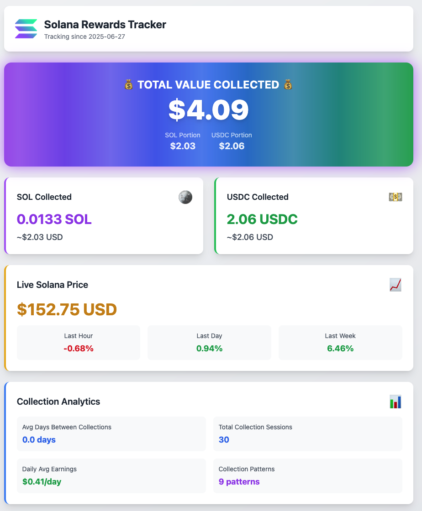
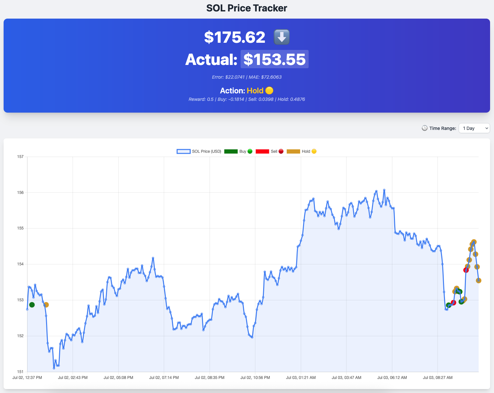
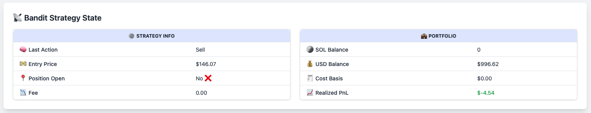
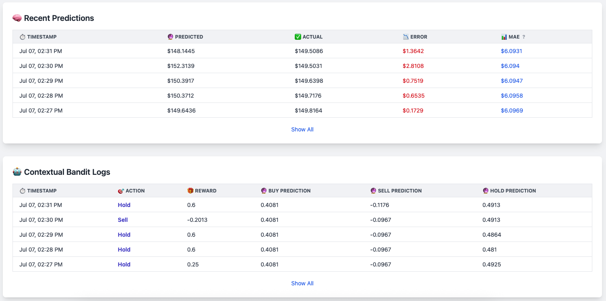

# 🧠 Solana Rewards & Trading Bot Tracker

A Flask web application that tracks and displays Solana rewards from [**Orca** liquidity pools](https://docs.orca.so/) using the [Helius API](https://docs.helius.dev/). **Now featuring an experimental automated trading bot for SOL/USDC swaps via the [Jupiter Ultra API](https://dev.jup.ag/docs/ultra-api/)!** In addition to passive liquidity tracking, the app now includes:

- 💸 **Real‑time SOL/USDC Liquidity Pool Monitoring** - Tracks token redemptions and rewards from Orca’s concentrated liquidity pools using CLMM tech [github.com+15docs.orca.so+15dev.jup.ag+15](https://docs.orca.so/?utm_source=chatgpt.com).
- 🤖 **Automated SOL/USDC Trading Bot (Experimental)** - Framework for live trading and execution using the Jupiter Ultra API , with contextual bandit‑driven buy/sell/hold decisions.
- 📈 **SOL Price Forecasting** - Uses historical price data to predict short‑term Solana price movements.
- 🎯 **Contextual Bandit Trading Agent** - A reinforcement learning agent that learns to buy, sell, or hold SOL based on:
  - Momentum and trend signals
  - Statistical features (Sharpe ratio, rolling mean, price deviations)
  - Profit and loss from past trades
- 📊 **Interactive Web Dashboard** - Visualizes price trends, agent decisions, portfolio state, and trade logs.

This project blends DeFi analytics, machine learning, and intelligent trading automation for Solana.



## Features

- ~~Real-time tracking of COLLECT_FEES events from your Solana wallet~~ Using the free API tier we refresh every 2 hours!
- SQLite database storage for transaction history
- Web dashboard displaying total SOL and USDC rewards
- Live SOL price data from LiveCoinWatch
- Background fetching with configurable intervals
- Backfill functionality for historical data

### Bonus SOL Price Database/Scraper

We are using the LiveCoinWatch API to grab the price of SOL and stashing in a SQLite database for long term analysis and statistical display.

You can start the price fetcher, on a `screen` session, by executing this command(Note, this is NOT NEEDED if you are running app.py, it will dispatch the predictions and combined the logged output so you only have one script to run!):

```bash
python sol_price_fetcher.py
```

This will count the API calls that remain for the day and ask you how often it should fetch prices based on the math it does. I have it fetching the price of SOL every five minutes. You can then see a chart of the last 288 price fetches (24 hours @ 5 minutes between fetches), the standard deviation, 24 hour range, low, high and so forth at `http://localhost:5030/sol-tracker`.



### Bonus SOL Price Prediction and Bandit Actions



The `sol_price_fetcher.py` script incorporates machine learning models for experimental SOL price prediction and automated action suggestions:

- **Online Price Prediction**: Utilizes the `river` library for online machine learning. A linear regression model (`river.linear_model.LinearRegression`) combined with a standard scaler (`river.preprocessing.StandardScaler`) is trained incrementally with new price data. This model predicts the next SOL price point.
- **Contextual Bandit for Actions**: A contextual bandit algorithm is implemented to suggest "buy", "sell", or "hold" actions. It uses separate online learning models (again, typically linear regression) for each potential action, learning to predict the expected reward based on the current market context (price features, volatility, etc.). The action with the highest predicted reward is chosen, with some randomness (epsilon-greedy strategy) to encourage exploration.
  Predictions, model metrics (like Mean Absolute Error for price prediction), and bandit action logs (including chosen action, predicted rewards, and context) are stored in the `sol_prices.db` SQLite database.

Visit `http://localhost:5030/sol-tracker` to view:

- Price chart with statistics
- Recent price predictions vs actuals
- Latest bandit decision with buy/sell/hold action and reward



## Roadmap & Issues

This project began as a simple Orca rewards tracker, but has since evolved into something more complex: a Solana trading assistant, price predictor, and contextual bandit strategy simulator.

While we're still focused on tracking Orca liquidity pool redemptions, the application now includes intelligent trade decisions based on market signals. That brings new opportunities—and responsibilities—for improving the reliability, safety, and interpretability of the trading logic.

We're currently not collecting certain data points like the total sum of all fees, but for now the model is performing adequately without this information. Eventually, richer logging may improve transparency and downstream analytics.

---

### Example Strategy in Scope

_“Deposit a large amount into an [Orca.so](https://orca.so/ "Orca - Solana Trading and Liquidity Provider Platform") SOL/USDC pool. These pools are popular and generally pay consistent rewards. Use this application to track returns, and instead of reinvesting those rewards into the pool, allow the contextual bandit to reinvest them into SOL when conditions are favorable. For example, a liquidity range of $130 to $280 may be appropriate for 2024-2025. When SOL trades within that range, liquidity fees are generated, and this app helps determine whether to hold, buy, or exit into USDC.”_

This strategy illustrates how both passive income and machine-assisted trading can coexist in a portfolio.

---

## 🚧 Trading Bot Integration (Experimental)

> **Note:**
> The Jupiter Ultra Trading Bot integration is currently **experimental and under development**.
> The framework for automated trading is being built, but it is **untested** and should not be used with real funds until thoroughly validated.

### Trading Bot Features (In Progress)

- **Automated Trading via Jupiter Ultra API:**
  The system can fetch quotes, sign transactions, and execute swaps between SOL and USDC using the Jupiter Ultra API.
- **Contextual Bandit Integration:**
  The trading bot is designed to act on buy/sell/hold recommendations from the contextual bandit model.
- **Trade Logging:**
  All attempted trades and execution results are logged to a dedicated `sol_trades.db` SQLite database for audit and analysis.
- **Balance Checks:**
  The bot checks wallet balances before attempting trades.
- **.env Controlled:**
  Trading is only enabled if the required private key is present in `.env` and `ENABLE_LIVE_TRADING=Y` is set.

### How It Works (Framework)

1. **Balance Check:**
   Before trading, the bot checks if there is enough SOL or USDC to execute the desired action.
2. **Quote Fetch:**
   The bot fetches a quote/order from Jupiter Ultra for the intended swap.
3. **Transaction Signing:**
   The unsigned transaction from the quote is signed locally using the wallet keypair.
4. **Order Execution:**
   The signed transaction and request ID are sent to Jupiter Ultra's `/execute` endpoint.
5. **Logging:**
   All order and execution details are stored in `sol_trades.db`.

### Enabling/Disabling Trading

- Trading is **disabled by default**.
- To enable live trading, set the following in your `.env` file:
  ```
  ENABLE_LIVE_TRADING=Y
  SOL_PRIVATE_KEY=your_private_key_here
  SOL_PUBLIC_KEY=your_public_key_here
  ```
- If the private key is missing, the trading bot will not be initialized and the rest of the application will continue to run.

### ⚠️ Disclaimer

- **This trading logic is untested and should be considered experimental.**
- **Do not use with real funds until you have thoroughly reviewed and tested the code.**
- The authors are not responsible for any financial loss or unintended trades.

---

**For more details, see the `trading_bot.py` and `sol_price_fetcher.py` files.**

## Tech Stack

- Python 3.10+
- Flask
- SQLite
- Tailwind CSS for UI styling
- Chart.js for charts
- Helius API for Solana blockchain data
- LiveCoinWatch API for SOL price data

## Setup

### 1\. Clone the repository

bash

```bash
git clone https://github.com/JHenzi/OrcaRewardDashboard
cd solana-rewards-tracker
```

### 2\. Install dependencies

bash

```bash
pip install -r requirements.txt
```

### 3\. Set up environment variables

Copy the `.env.example` file to `.env` and fill in your API keys and wallet address:

bash

```bash
cp .env.example .env
```

Edit the `.env` file with your actual values:

env

```env
HELIUS_API_KEY=your_helius_api_key_here
SOLANA_WALLET_ADDRESS=your_solana_wallet_address_here
LIVECOINWATCH_API_KEY=your_livecoinwatch_api_key_here
```

### 4\. Run the application

There are two scripts that must continously run. The Flask application on `app.py` and the price fetcher/predictor.

We suggest running each of these on separate `screen` sessions.

```bash
python app.py
python sol_price_fetcher.py
```

The application will be available at `http://localhost:5030`

## API Keys Required

### Helius API Key

- Sign up at [Helius](https://helius.xyz/)
- Create a new project
- Copy your API key to the `.env` file

### LiveCoinWatch API Key

- Sign up at [LiveCoinWatch](https://www.livecoinwatch.com/tools/api)
- Get your API key
- Copy it to the `.env` file

## Configuration

You can customize the application behavior through environment variables in the `.env` file:

- `HELIUS_API_KEY`: Your Helius API key (required)
- `SOLANA_WALLET_ADDRESS`: Your Solana wallet address to track (required)
- `LIVECOINWATCH_API_KEY`: Your LiveCoinWatch API key (required)
- `DATABASE_PATH`: Path to SQLite database file (default: rewards.db)
- `FLASK_HOST`: Flask server host (default: 0.0.0.0)
- `FLASK_PORT`: Flask server port (default: 5030)
- `FLASK_DEBUG`: Enable Flask debug mode (default: True)
- `FETCH_INTERVAL_SECONDS`: Background fetch interval in seconds (default: 7200 = 2 hours)
- `LAST_KNOWN_SIGNATURE`: Starting signature for backfill operations (this is the transaction ID from SolScan that you want to fetch since, i.e. the transaction you deposited your liquidity... this may eat into your API calls for the month - adjust fetch interval accordingly)

## Project Layout

A brief overview of the project structure:

- `app.py`: The main Flask web application. Handles HTTP requests, interacts with the `rewards.db` database, and renders HTML templates. This is the core controller for the rewards tracking dashboard.
- `sol_price_fetcher.py`: A script responsible for fetching SOL price data from the LiveCoinWatch API, storing it in `sol_prices.db`, and running the machine learning models for price prediction and bandit actions. It can be run independently or is triggered by `app.py`.
- `requirements.txt`: Lists the Python dependencies for the project.
- `.env.example`: A template for the environment variables file (`.env`). You need to copy this to `.env` and fill in your API keys and other configurations.
- `templates/`: Contains the HTML templates used by Flask to render the web pages (e.g., `index.html`, `sol_tracker.html`).
- `rewards.db`: (Created at runtime) SQLite database for storing Solana reward transaction data.
- `sol_prices.db`: (Created at runtime) SQLite database for storing SOL price history, predictions, and bandit logs.
- `sol_model.pkl`, `sol_metric.pkl`, `sol_horizon_model.pkl`: (Created at runtime) Saved machine learning models and metrics.
- `bandit_state.json`: (Created at runtime) Stores the state of the bandit portfolio simulation.
- `trading_bot.py`: Jupiter ULTRA Trading API function class. Executes orders (quotes) and transactions on Jupiter's swap API. Goal being capital appreciation.

## Usage

### Web Dashboard

Visit `http://localhost:5030` to view:

- Total SOL and USDC rewards collected
- Current SOL price and USD value of rewards
- Collection analytics (frequency, sessions, daily rate, patterns)

### SOL Price & Predictions

Visit `http://localhost:5030/sol-tracker` to view:

- SOL price chart with recent 24-hour data
- Statistical summaries (SMA, range, std dev, etc.)
- Latest model price predictions vs actuals
- Bandit buy/sell/hold actions and rewards

### Backfill Historical Data

Visit `http://localhost:5030/backfill_newer` to manually trigger fetching newer transactions.

### API Endpoints

The application provides the following API endpoints for programmatic access to data:

- **Get Latest Price Prediction:**

  - **URL:** `/api/latest-prediction`
  - **Method:** `GET`
  - **Description:** Retrieves the most recent price prediction generated by the system.
  - **Success Response (200 OK):**
    ```json
    {
      "timestamp": "2023-10-27T10:30:00.123Z", // ISO format timestamp of the data point used for prediction
      "predicted_rate": 135.5,
      "actual_rate": 135.25,
      "error": 0.25,
      "mae": 0.15, // Mean Absolute Error at the time of this prediction
      "created_at": "2023-10-27T10:35:05.456Z" // ISO format timestamp when the prediction record was created
    }
    ```
  - **Error Response (404 Not Found):** If no predictions are found.
    ```json
    {
      "error": "No predictions found"
    }
    ```
  - **Error Response (500 Internal Server Error):** For database or other server-side issues.
    ```json
    {
      "error": "Database error"
    }
    ```

- **Get Latest Bandit Action:**

  - **URL:** `/api/latest-bandit-action`
  - **Method:** `GET`
  - **Description:** Retrieves the most recent action (buy/sell/hold) decided by the contextual bandit.
  - **Success Response (200 OK):**
    ```json
    {
      "timestamp": "2023-10-27T10:30:00.123Z", // ISO format timestamp of the data point used for the action
      "action": "buy",
      "reward": 0.05,
      "prediction_buy": 0.12,
      "prediction_sell": -0.05,
      "prediction_hold": 0.01,
      "data_json": {
        /* Contextual features used for this decision */
      },
      "created_at": "2023-10-27T10:35:05.789Z" // ISO format timestamp when the bandit log record was created
    }
    ```
  - **Error Response (404 Not Found):** If no bandit actions are found.
    ```json
    {
      "error": "No bandit actions found"
    }
    ```
  - **Error Response (500 Internal Server Error):** For database or other server-side issues.
    ```json
    {
      "error": "Database error"
    }
    ```

## Security Notes

- Never commit your `.env` file to version control
- The `.gitignore` file is configured to exclude sensitive files
- Keep your API keys secure and rotate them regularly

## Contributing

1. Fork the repository
2. Create a feature branch
3. Make your changes
4. Test your changes
5. Submit a pull request

## License

This project is open source and available under the [MIT License](LICENSE).
