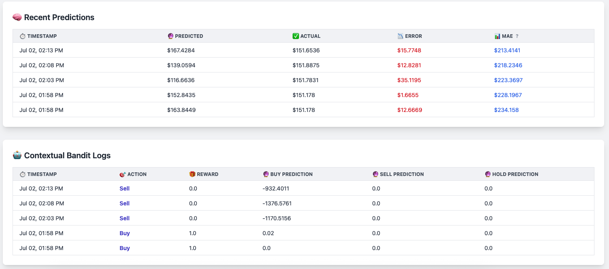

# Solana Rewards Tracker

A Flask web application that tracks and displays Solana rewards from Orca liquidity pools using the Helius API.


## Features

- ~~Real-time tracking of COLLECT_FEES events from your Solana wallet~~ Using the free API tier we refresh every 2 hours!
- SQLite database storage for transaction history
- Web dashboard displaying total SOL and USDC rewards
- Live SOL price data from LiveCoinWatch
- Background fetching with configurable intervals
- Backfill functionality for historical data

### Bonus SOL Price Database/Scraper

We are using the LiveCoinWatch API to grab the price of SOL and stashing in a SQLite database for long term analysis and statistical display.

You can start the price fetcher, on a `screen` session, by executing this command:

```bash
python sol_price_fetcher.py
```

This will count the API calls that remain for the day and ask you how often it should fetch prices based on the math it does. I have it fetching the price of SOL every five minutes. You can then see a chart of the last 288 price fetches (24 hours @ 5 minutes between fetches), the standard deviation, 24 hour range, low, high and so forth at `http://localhost:5030/sol-tracker`.


### Bonus SOL Price Prediction

Messing around with online learning models we've implemented in `sol_price_fetcher.py` a Solana price prediction using ML / regression analysis. To start we're only considering the live data as it comes in and storing the predictions as they are made into the **hardcoded** SQLite database named `sol_prices.db` (Todo: abstract this into `.env` as a best practice)



## Setup

### 1\. Clone the repository

bash

```bash
git clone https://github.com/JHenzi/OrcaRewardDashboard
cd solana-rewards-tracker
```

### 2\. Install dependencies

bash

```bash
pip install -r requirements.txt
```

### 3\. Set up environment variables

Copy the `.env.example` file to `.env` and fill in your API keys and wallet address:

bash

```bash
cp .env.example .env
```

Edit the `.env` file with your actual values:

env

```env
HELIUS_API_KEY=your_helius_api_key_here
SOLANA_WALLET_ADDRESS=your_solana_wallet_address_here
LIVECOINWATCH_API_KEY=your_livecoinwatch_api_key_here
```

### 4\. Run the application

There are two scripts that must continously run. The Flask application on `app.py` and the price fetcher/predictor.

We suggest running each of these on separate `screen` sessions.

```bash
python app.py
python sol_price_fetcher.py
```

The application will be available at `http://localhost:5030`

## API Keys Required

### Helius API Key

- Sign up at [Helius](https://helius.xyz/)
- Create a new project
- Copy your API key to the `.env` file

### LiveCoinWatch API Key

- Sign up at [LiveCoinWatch](https://www.livecoinwatch.com/tools/api)
- Get your API key
- Copy it to the `.env` file

## Configuration

You can customize the application behavior through environment variables in the `.env` file:

- `HELIUS_API_KEY`: Your Helius API key (required)
- `SOLANA_WALLET_ADDRESS`: Your Solana wallet address to track (required)
- `LIVECOINWATCH_API_KEY`: Your LiveCoinWatch API key (required)
- `DATABASE_PATH`: Path to SQLite database file (default: rewards.db)
- `FLASK_HOST`: Flask server host (default: 0.0.0.0)
- `FLASK_PORT`: Flask server port (default: 5030)
- `FLASK_DEBUG`: Enable Flask debug mode (default: True)
- `FETCH_INTERVAL_SECONDS`: Background fetch interval in seconds (default: 7200 = 2 hours)
- `LAST_KNOWN_SIGNATURE`: Starting signature for backfill operations (this is the transaction ID from SolScan that you want to fetch since, i.e. the transaction you deposited your liquidity... this may eat into your API calls for the month - adjust fetch interval accordingly)

## Usage

### Web Dashboard

Visit `http://localhost:5030` to view your rewards dashboard showing:

- Total SOL rewards collected
- Total USDC rewards collected
- Current SOL price
- Total USD value of rewards
- Data collection start date

**Collection Analytics:**

- **Average Days Between Collections**: Track how frequently you collect rewards
- **Total Collection Sessions**: Count of all reward collection events
- **Daily Earnings Rate**: Average earnings per day across your collection history
- **Collection Patterns**: Number of distinct collection time patterns detected

### Backfill Historical Data

Visit `http://localhost:5030/backfill_newer` to manually trigger a backfill of newer transactions.

## Database Schema

The application uses SQLite with two main tables:

### collect_fees

Stores reward collection events with columns:

- `signature`: Transaction signature
- `timestamp`: Transaction timestamp
- `fee_payer`: Fee payer address
- `token_mint`: Token mint address
- `token_amount`: Amount of tokens transferred
- `from_token_account`: Source token account
- `to_token_account`: Destination token account
- `from_user_account`: Source user account
- `to_user_account`: Destination user account

### tokens

Stores token metadata with columns:

- `mint`: Token mint address (primary key)
- `symbol`: Token symbol
- `name`: Token name
- `decimals`: Token decimal places

## Security Notes

- Never commit your `.env` file to version control
- The `.gitignore` file is configured to exclude sensitive files
- Keep your API keys secure and rotate them regularly

## Contributing

1. Fork the repository
2. Create a feature branch
3. Make your changes
4. Test your changes
5. Submit a pull request

## License

This project is open source and available under the [MIT License](LICENSE).
